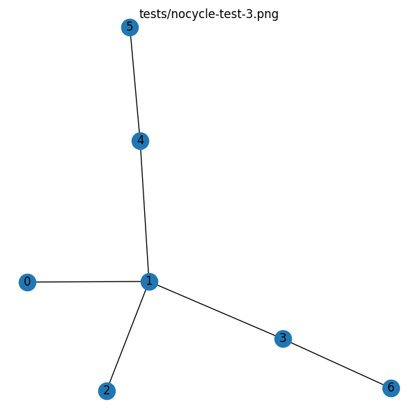
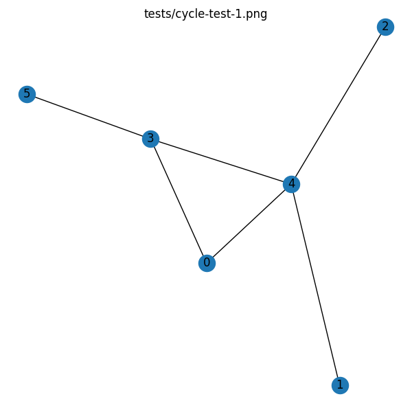

[](https://classroom.github.com/online_ide?assignment_repo_id=2858705&assignment_repo_type=AssignmentRepo)
# EE 595 Lab 3 (Software Track)
In this lab, we are going to practice more of the object-oriented programming in C++ plus design an algorithm to find the shortest path in a graph. The lab consists of two programs. The first program is mandatory but the second program is for extra credit and can be submitted only if the first one was completed. For the mandatory part, you will check if a vector is an eigenvector for a matrix and if so find the corresponding eigenvalue. To check that, you will need to perform a matrix-vector multiplication and hopefully, you already have the code for this and therefore we would like you to focus more on the object-oriented part and use as many features of C++ as possible. For the extra credit part, you will write a simple algorithm to find the shortest path in a network. Many problems can be rewritten in a graph form and the solution can be found using the shortest path algorithm. We will explore this direction more in the next lab.

## :clipboard: Requirements
**Please read the entire file before proceeding!**
- **Deadline:** Friday, June 19, 2020, 23:59 PDT
- **Score:** Maximum 200 points.
    - 100 points for the first C++ program.
    - 50+50 points (extra credit) for the second C++ program. The extra credit is applied only if the first program is completed.
- **Submission limit:** Unlimited.
- **Time limit:** 3 minutes for each of the two grading scripts, matrix-vector multiplication program and the shortest path.
- **Files:** You are allowed to change only the ``lab3a.cpp``, ``lab3b.cpp``, ``Tensors.cpp``, and ``Tensors.h`` files. Changing other files will result in 0 points for this lab irrespective of the auto-grading result. In case you changed other files by accident, use the ``git`` command or the GitHub website to revert them to their initial content.
- **Grading:** Both C++ programs will be auto graded by GitHub every time you submit new files.
- **Dependencies:** To work on this lab on your machine you will need to have ``python3``, ``pip3``, ``gcc``, ``make``, and ``git`` programs installed. To install them on Ubuntu, in a terminal run ``sudo apt install python3 python3-pip build-essential git``. Moreover, to run the grading script locally on your machine the ``networkx``, ``matplotlib``, and ``numpy`` Python 3 packages must be installed. To install these packages use the command ``pip3 install networkx numpy matplotlib``. 
- **Online IDE:** You can work on this assignment online using the [repl.it](https://repl.it/) website which has all the required tools installed. Note, you still need to install the Python package using the command ``pip3 install networkx numpy``. **Please login using your GitHub account**. If the [repl.it](https://repl.it/) website does not allow you to open this repository then you need to claim your [GitHub Student Pack](https://education.github.com/discount_requests/new) (takes less than a minute).


## :keyboard: Usage
- ``make install`` to install the Python 3 packages required for auto grading.
- ``make lab3a`` to compile the first C++ program.
- ``./lab3a.out matrix.txt vector.txt`` to run the first C++ program assuming ``matrix.txt`` and ``vector.txt`` exist. Run ``make lab3a`` first to generate the executable.
- ``make test-lab3a`` to evaluate the first C++ program.
- ``make lab3b`` to compile the second C++ program.
- ``./lab3b.out network.txt`` to run the second C++ program assuming ``network.txt`` exists. Run ``make lab3b`` first to generate the executable.
- ``make test-nocycle`` to evaluate the second C++ program on a network that does not contain loops.
- ``make test-cycle`` to evaluate the second C++ program on a network that contains loops.


## :abacus: C++ Problem Description
Develop a program that checks if a vector is an eigenvector for a matrix, and if so, finds the corresponding eigenvalue. The program will receive two file names as arguments, the first file will contain the data for the matrix ``M`` and the second file will contain the data for the vector ``v``. The result will be written to the ``result.txt`` file. The ``result.txt`` file should contain on the first line either ``x``, ``No``, or ``Error``, where ``x`` is a scalar different from ``0`` and representing the eigenvalue. If ``v`` is an eigenvector of the matrix ``M`` then ``v`` must not be a zero vector and the matrix-vector multiplication ``M * v`` produces a vector that is a multiple of ``v``, i.e., the matrix-vector multiplication ``M * v`` is equivalent to multiplying the vector with a scalar ``x * v``, the program should output value of the scalar ``x``. If such scalar does not exist for the vector ``v``, the program should output ``No``. If the matrix-vector multiplication cannot be performed for any reason the program should output ``Error``. 

Since checking if a vector is an eigenvector for a matrix resumes to a matrix-vector multiplication, we would like you to focus more on the object-oriented part and use as many features of C++ as possible. In the ``Tensors.cpp`` and ``Tensors.h`` files write the implementation details for the ``Vector`` and ``Matrix`` classes. It is up to you if one class inherits from another (recommended) or you write the two implementations independently. 

We recommend you to write the following class methods:
- Multiple constructors such as the default constructors or the parameterized constructors such as ``Vector(M)`` and ``Matrix(M, N)`` where ``M`` and ``N`` specify the dimensions. Dynamically allocate the memory to store the data.
- Write the class destructor to delete the dynamically allocated data.
- Implement and experiment with the copy constructor. Explore when C++ performs a copy operation.
- Implement the member access operator ``operator[]`` for both, ``Vector`` and ``Matrix`` classes. Throw an exception if the accessing outside bounds. Note, pay special attention when implementing the operator for the ``Matrix`` class, ``Matrix M(2, 2); M[0][1] = 2;`` should work.
- Write the implementation for the scalar-vector multiplication operator and the matrix-vector multiplication.
- Write the implementation for the vector comparison ``operator==`` to check if ``M * v == x * v``. Since the vector values are floats you will need to use a delta to correctly compare the vectors.
- Write the implementation for the vector bool conversion ``operator bool`` which returns ``false`` only if all vector elements are 0.
- Implement the stream operator ``>>`` to read the data from the file or console.


Write the logic in ``lab3a.cpp`` that reads the matrix and the vector from the two files and outputs the correct answer to ``result.txt`` file. The format of the input files is the same as in the previous labs: 
- The first row contains two numbers ``m n`` separated by space, and where ``m`` specifies the number of rows and ``n`` the number of columns of the matrix. For the vector file, ``n`` is always ``1``.
- The following ``m`` lines contain ``n`` numbers separated by space. Numbers are in floating points format in this case.

Note, the dimensions might not be compatible with the matrix-vector multiplication or for the vector comparison.

#### Example
Executing the following command ``./lab3a.out matrix.txt vector.txt`` with the content for ``matrix.txt``:
```
 3  3
-2  0  0
 0  1  0
 0  0 -1
```
and with the content for ``vector.txt``:
```
 3  1
 3
 0
 0
```
should produce a ``result.txt``:
```
-2
```

Whereas for the same ``matrix.txt`` file and a ``vector.txt`` with the content:
```
 3  1
 0
 0
 0
```
the content of ``result.txt`` should be:
```
No
```


## :abacus: Problem Description
Create a program that finds the shortest path between the source and the destination nodes in a given network. The two nodes along with the network configuration will be given in a file and the file name will be passed as an argument to the program. After calculating the number of segments between the two nodes, the program will write the result into the ``result.txt`` file. 
The input file will have the following format: 
- The first line will contain 3 numbers separated by space, ``N S T``, where ``N`` is the number of edges in the network, ``S`` is the source node, and ``T`` is the target/destination node. 
- The next ``N`` lines will contain 2 numbers, the two nodes between which a connection exists.

Note, there will always exist only one path between the source and the destination and the networks will not contain more than 10 nodes. For the shortest path calculation, you can use the [Bellman-Ford algorithm](https://en.wikipedia.org/wiki/Bellman%E2%80%93Ford_algorithm). The algorithm is easy to implement plus Bellman was a professor at USC.


#### Example
Executing the following command ``./lab3b.out network.txt`` where the content of ``network.txt`` is:
```
 6  2  5
 6  0
 6  1
 6  2
 6  3
 6  4
 6  5
```
The file describes the following graph:


The graph has 6 edges thus ``N`` is 6 and we want to find the shortest path between node 2 and node 5. Since there is one node in between the source and target, the center node 6, the result is 2 and therefore ``result.txt`` file should have the following content:
```
2
```

#### Test networks
The network configuration for each test will remain the same every time the grading script runs, however, the source and destination nodes will change.







## :bulb: Hints
- Check the ``lab3_test.py`` file to see what tests your programs have to pass.
- If your computer struggles to run the Linux virtual machine you can use the [repl.it](https://repl.it/) website which has all the needed tools preinstalled. If you claim your [GitHub Student Pack](https://education.github.com/discount_requests/new) and log in using GitHub then the available resources on this website are more than enough for this assignment.


## :memo: Grading
Grading is done automatically by GitHub every time you push your commits. Allow some time for the grading script to complete. The grading time depends on how efficient your code is. Each part of the homework has an independent time limit. Check the requirements section for details. 

GitHub will mark your commit message based on the grading result:
  * :white_check_mark: All test scenarios pass for all evaluation commands 
  * :x: At least one test scenario failed in at least one evaluation command
  
To see the grading result for the last commit click:
> *Actions* → *Commit message to check* → *Scroll down for the auto grading result*
>
> [](https://gyazo.com/cd72e0166bdeb3ef291c9f2b4454f4c7)

For a detailed grading report containing each failed test click:
> *Actions* → *Commit message to check* → *Autograding in the left menu* → *Expand ``Run education/autograding@v1``*
>
> [](https://gyazo.com/2c98694f1d372a5be13e95641912228e)
